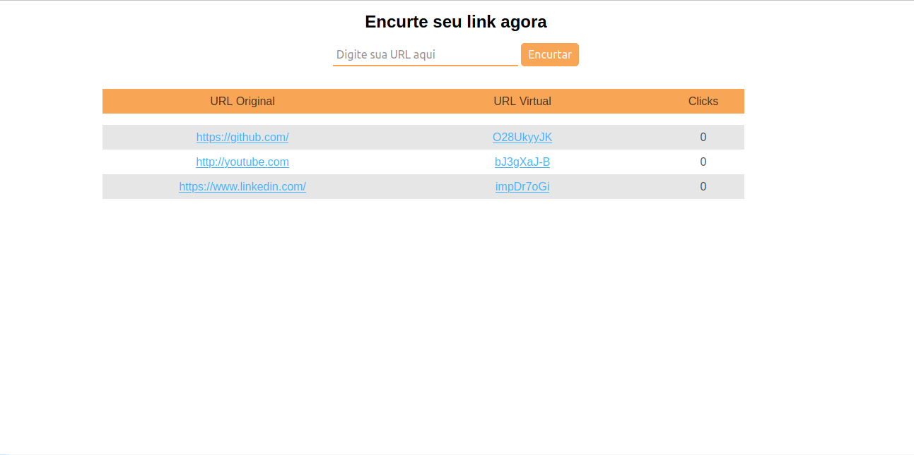

# Encurtador de Link

Encurtador de link construído em Node.js para o backend e EJS como template engine para criação do frontend com marcações HTML no qual faz uso das rotas, seja enviando ou recebendo dados. 

<h3>Recursos</h3>
  <ul>
    <li>Node.js para criação do banckend</li>
    <li>EJS para construção da View</li>
    <li>Uso de banco de dados</li>
  </ul>
  
  <h3>Screenshot</h3>
    <h4 align="center">
      
    </h4>
    <h4 align="center">
      
    </h4>

